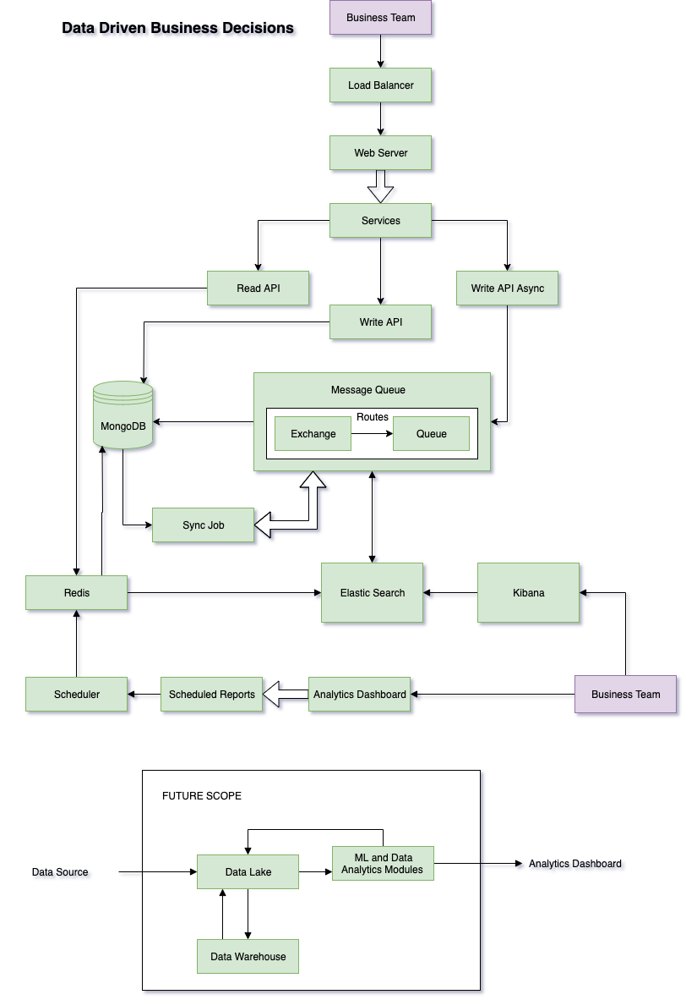

[go to main page](README.md) <br>
# Product Variable Growth

## Introduction

Server architecture for taking data driven business decisions

----
## Project Modules
1. Load Balancer
2. Web Server
3. MongoDB
4. Elastic Search
5. Redis
6. Message Queue
8. Scheduled Reports
7. Kibana and Analytics Dashboard

----
## Documentation

----
#### System Architecture


#### Project Assumptions and Explanation


----
#### Models

- Product Model
    ```
    {
        productId: String
        name: String
        category: String
    }
    ```

- User Model
    ```
    {
        userId: String
        name: String
        category: String
        address: [ String ]
    }
    ```

- Order Model
    ```
    {
        orderId: String
        productIds: [ String ]
        userId: String
        address: String
    }
    ```

- Delivery Model
    ```
    {
        deliveryId: String
        orderId: String
        assembly: // Assembly details for each product
        [
            {
                productId: String
                cost: Number,
                startTime: String, // start time of assembly
                endTime: String, // end time of assembly
                headCount: Number // Total persons who assembled the product
            },
            ...
        ]
    }
    ```

----
